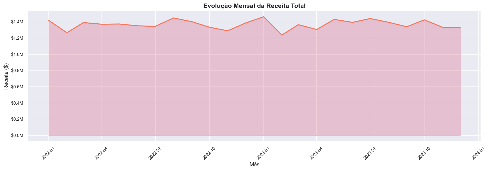
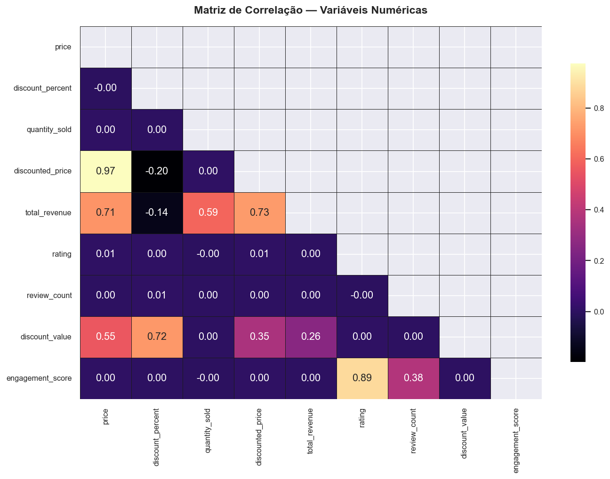
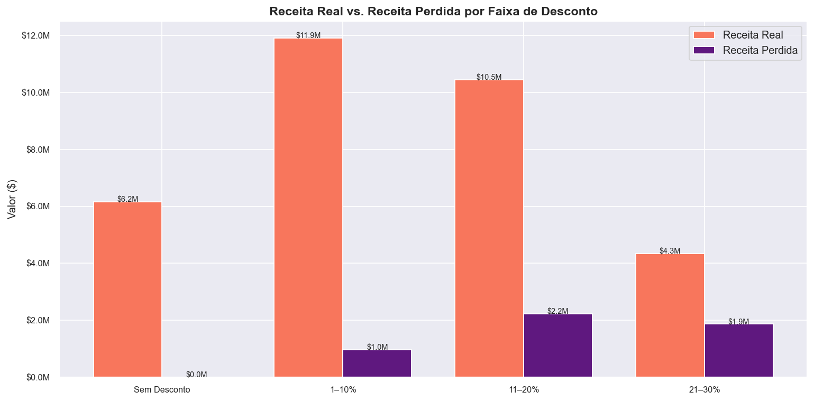
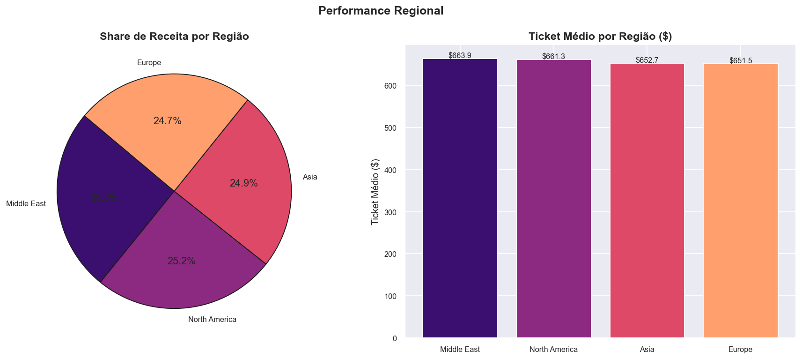
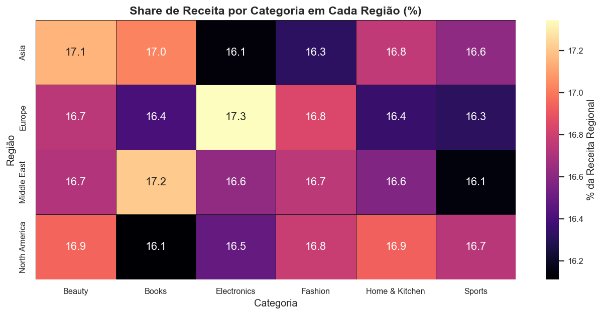

<h1 align="center">🛒 Amazon Sales — Pipeline de Análise de Dados</h1>

<p align="center">
  <em>Pipeline completo de ETL, validação e análise estratégica sobre 50.000 pedidos do mercado global da Amazon</em>
</p>

<p align="center">
  
  
  
  
  
</p>

---

## Visão Geral

Este projeto implementa um **pipeline de dados end-to-end** sobre um dataset de vendas da Amazon com 50.000 registros, cobrindo desde a ingestão e limpeza até a análise estratégica multidimensional. O objetivo é transformar dados transacionais brutos em inteligência de negócio acionável, investigando o impacto de descontos na receita, variações de demanda por região e padrões de satisfação de clientes.

---

## Dataset

| Atributo | Valor |
|---|---|
| **Registros** | 50.000 pedidos |
| **Colunas originais** | 13 |
| **Colunas após engenharia** | 20 |
| **Período** | 2022 – 2023 |
| **Regiões** | North America, Asia, Europe, Middle East |
| **Categorias** | Books, Fashion, Sports, Beauty, Electronics, Home & Kitchen |
| **Métodos de pagamento** | UPI, Credit Card, Debit Card, Wallet, Cash on Delivery |

---

## Arquitetura do Pipeline

```
amazon_sales_dataset.csv
          │
          ▼
┌─────────────────────────┐
│   Ingestão & Inspeção   │  ── shape, dtypes, nulos, duplicatas
└──────────┬──────────────┘
           │
           ▼
┌─────────────────────────┐
│  Limpeza & Validação    │  ── tipagem, regras de negócio, outliers IQR
└──────────┬──────────────┘
           │
           ▼
┌─────────────────────────┐
│  Feature Engineering    │  ── KPIs: discount_value, revenue_lost,
│                         │     price_tier, engagement_score
└──────────┬──────────────┘
           │
           ▼
┌─────────────────────────┐
│  Análise & Visualização │  ── EDA · Descontos · Regional · Satisfação
└──────────┬──────────────┘
           │
           ▼
  amazon_sales_cleaned.csv
```

---

## Etapas do Notebook

### 1 · Limpeza e Validação
- Conversão de `order_date` para `datetime` e variáveis categóricas para o tipo `category`
- Validação de regras de negócio: desconto ∈ [0, 100], rating ∈ [0, 5], `discounted_price ≤ price`
- Conferência de consistência da coluna `total_revenue` contra o cálculo esperado
- Detecção de outliers pelo método IQR em `price`, `quantity_sold`, `total_revenue` e `review_count`

### 2 · Feature Engineering

| Nova Feature | Descrição |
|---|---|
| `discount_value` | Valor absoluto do desconto por pedido ($) |
| `revenue_lost` | Receita perdida = `discount_value × quantity_sold` |
| `potential_revenue` | Receita sem desconto = `price × quantity_sold` |
| `discount_tier` | Faixa de desconto: Sem Desconto / 1–10% / 11–20% / 21–30% / 31%+ |
| `price_tier` | Segmento de preço: Baixo / Médio / Alto / Premium |
| `engagement_score` | `(rating / 5) × log(1 + review_count)` |

---

## Análises e Insights

### 📊 EDA — Evolução Mensal da Receita

<p align="center">
  
</p>

> A série temporal revela o comportamento da receita ao longo de 2022–2023. A análise da sazonalidade e dos picos de demanda orienta decisões de estoque, campanhas e alocação de recursos por período.

---

### 📊 EDA — Matriz de Correlação

<p align="center">
  
</p>

> **Correlação positiva forte:** `price` ↔ `total_revenue` e `price` ↔ `discounted_price`, como esperado.  
> **Correlação fraca:** `discount_percent` ↔ `rating` — descontos não têm impacto relevante na satisfação do cliente.  
> Este mapa serve como **guia de seleção de features** para futuros modelos preditivos de precificação.

---

### 📉 Impacto de Descontos e Receita

<p align="center">
  
</p>

> A faixa de **21–30% de desconto** concentra a maior receita perdida em termos absolutos, sinalizando um ponto crítico de otimização da política de preços. O KPI consolidado aponta que os descontos representam uma fatia significativa da receita potencial total — informação essencial para estratégias de precificação dinâmica.

---

### 🌍 Performance Regional

<p align="center">
  
</p>

> **North America** lidera em volume de receita total, enquanto **Middle East** apresenta o maior ticket médio por pedido. A disparidade entre share de receita e ticket médio revela oportunidades distintas de estratégia de crescimento por região.

---

### 🌍 Preferência de Categoria por Região

<p align="center">
  
</p>

> O heatmap evidencia **demanda localizada**: cada região possui uma distribuição distinta de receita entre categorias. Este padrão é crítico para estratégias de sortimento regional, campanhas segmentadas e gestão de estoque localizado.

---

## Sumário de Insights

| # | Tema | Insight |
|---|------|---------|
| 1 | Receita | Distribuição assimétrica — maioria dos pedidos em ticket baixo/médio |
| 2 | Correlação | `total_revenue` correlaciona fortemente com `price` e `quantity_sold` |
| 3 | Desconto | Faixa 21–30% concentra maior receita perdida absoluta |
| 4 | Desconto | Correlação fraca entre desconto e satisfação (rating) |
| 5 | Regional | North America lidera receita; Middle East lidera ticket médio |
| 6 | Regional | Preferências de categoria diferem significativamente por região |
| 7 | Satisfação | Electronics e Sports possuem os maiores engagement scores |
| 8 | Temporal | Volume de pedidos distribui-se uniformemente durante a semana |

---

## Tecnologias Utilizadas

| Ferramenta | Finalidade |
|---|---|
| **Pandas** | Manipulação, limpeza e transformação dos dados |
| **NumPy** | Cálculos vetorizados e feature engineering |
| **Matplotlib / Seaborn** | Visualizações estatísticas com paleta `magma` |
| **Jupyter Notebook** | Desenvolvimento interativo e análise reprodutível |

---

## Como Executar

**1. Clone o repositório**
```bash
git clone https://github.com/RuanSantos-Developer/amazon-sales-analysis.git
cd amazon-sales-analysis
```

**2. Instale as dependências**
```bash
pip install pandas numpy matplotlib seaborn jupyter
```

**3. Execute o notebook**

Abra `amazon_sales_analysis.ipynb` no Jupyter e execute todas as células em sequência. O dataset limpo será exportado automaticamente como `amazon_sales_cleaned.csv`.

> ⚠️ Certifique-se de que o arquivo `amazon_sales_dataset.csv` está na raiz do projeto antes de executar.

---

## Estrutura do Repositório

```
amazon-sales-analysis/
│
├── analysis/
│   ├── amazon_sales_analysis.ipynb    # Notebook completo (ETL + EDA)
│   └── amazon_sales_dataset.csv       # Fonte de dados brutos
│
├── images/
│   ├── categoria_desconto_receita.png
│   ├── desconto_receita.png
│   ├── desconto_satisfacao.png
│   ├── dist_categoricas.png
│   ├── dist_numericas.png
│   ├── engagement_heatmap.png
│   ├── heatmap_correlacao.png
│   ├── heatmap_regiao_categoria.png
│   ├── pagamento_regiao.png
│   ├── pedidos_dia_semana.png
│   ├── rating_categoria.png
│   ├── receita_categoria.png
│   ├── receita_mensal.png
│   ├── receita_regional_tempo.png
│   ├── regional_overview.png
│   └── scatter_desconto_receita.png
│
├── .gitignore
└── README.md
```

---

<p align="center">
  Desenvolvido por <strong>Ruan</strong> &nbsp;·&nbsp;
  <a href="www.linkedin.com/in/ruan-santos-780442218">LinkedIn</a> &nbsp;·&nbsp;
</p>